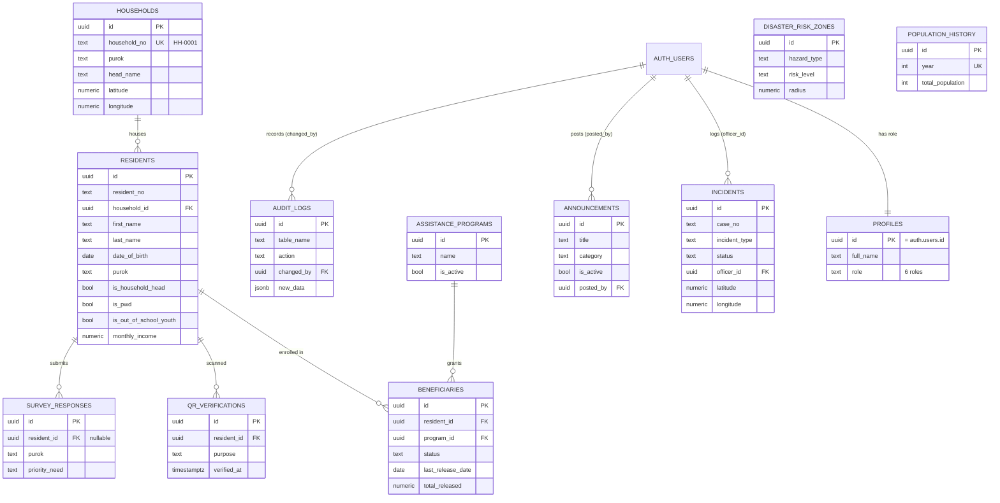

# PROTECT — Data Model Reference

**Barangay San Joaquin, Basco, Batanes**
Single source of truth for the database. Derived from the actual application code
(every table and field the app reads/writes) reconciled with `schema.sql` and the
migrations consolidated in `DATABASE_SETUP.sql`.

> Use this as the basis for your **ERD**, **System Flowchart**, and **Data Flow Diagram (DFD)**.

---

## 1. How the schema is assembled

The live database = **base schema** + **migrations**:

| Layer | File | Brings |
|-------|------|--------|
| Base tables | `schema.sql` | residents, households, incidents, profiles, beneficiaries, assistance_programs, qr_verifications, survey_responses, the `residents_with_age` view |
| Migrations (all-in-one) | `DATABASE_SETUP.sql` | 6-role profiles, Batanes crime types, `is_out_of_school_youth`, photo columns + buckets, and the tables `announcements`, `audit_logs`, `population_history`, `disaster_risk_zones` |

**To make Supabase match the system: run `DATABASE_SETUP.sql` once.**

---

## 2. Entities (tables)

Legend: 🔑 = primary key · 🔗 = foreign key · *italic* = optional/nullable

### `profiles` — app user accounts & roles
One row per Supabase Auth user (created automatically by a trigger on signup).

| Column | Type | Notes |
|--------|------|-------|
| 🔑 🔗 `id` | uuid | = `auth.users.id` (1-to-1) |
| *`full_name`* | text | |
| `role` | text | one of: `admin`, `officer`, `brgy_sec`, `tanod`, `viewer` |
| *`barangay`* | text | |
| `created_at` | timestamptz | |

### `residents` — individual residents (the core entity)
| Column | Type | Notes |
|--------|------|-------|
| 🔑 `id` | uuid | |
| `resident_no` | text | e.g. `RES-0001` |
| 🔗 *`household_id`* | uuid | → `households.id` (the household this person lives in) |
| `first_name`, `last_name` | text | |
| *`middle_name`, `suffix`* | text | |
| `date_of_birth` | date | |
| `age` | int | auto-set from DOB by trigger |
| `sex` | text | `Male` / `Female` |
| `civil_status` | text | Single / Married / Widowed / Separated / Annulled |
| `purok` | text | Sitio Hunan / Sitio Hagu / Sitio Tuva |
| `is_household_head` | bool | flags the head; their `household_id` points to the household they head |
| `is_voter`, `is_pwd`, `is_solo_parent`, `is_senior_citizen`, `is_out_of_school_youth` | bool | sector flags |
| *`pwd_type`* | text | Physical / Visual / Hearing / Intellectual / Psychosocial |
| `monthly_income` | numeric | |
| *`occupation`, `educational_attainment`, `contact_number`, `philhealth_no`* | text | |
| `created_at`, `updated_at` | timestamptz | |

> **View `residents_with_age`** = `residents` + computed `age`. The Resident Profiling list reads from this view.

### `households` — physical households / map pins
| Column | Type | Notes |
|--------|------|-------|
| 🔑 `id` | uuid | |
| `household_no` | text | unique, 4-digit format `HH-0001` |
| `purok` | text | Sitio Hunan / Hagu / Tuva |
| *`address`* | text | |
| *`head_name`* | text | head's name (text snapshot; the real link is via `residents.is_household_head`) |
| *`housing_type`* | text | Concrete / Semi-concrete / Wood / Makeshift |
| *`latitude`, `longitude`* | numeric | GIS map pin |
| ~~`water_source`, `electricity`~~ | text/bool | **deprecated** — still in DB with defaults, no longer used by the app |
| `created_at`, `updated_at` | timestamptz | |

### `incidents` — blotter / crime & incident records
| Column | Type | Notes |
|--------|------|-------|
| 🔑 `id` | uuid | |
| `case_no` | text | e.g. `INC-2025-001` |
| `incident_type` | text | Public Intoxication/Disorderly Conduct · Minor Physical Altercation · Domestic Dispute · Property Damage (Typhoon-related) · Environmental/Ordinance Violation · Stray Animal Complaint · Noise Disturbance · Others |
| `purok` | text | sitio |
| *`complainant`, `respondent`, `description`* | text | |
| `incident_date` | timestamptz | |
| `status` | text | Ongoing / Resolved / Escalated / Dismissed |
| *`resolved_date`* | date | |
| *`latitude`, `longitude`* | numeric | exact location → heatmap / pins |
| *`photo_url`* | text | evidence photo (Storage) |
| 🔗 *`officer_id`* | uuid | → `auth.users` |
| `created_at`, `updated_at` | timestamptz | |

### `assistance_programs` — aid programs (4Ps, AICS, etc.)
| Column | Type | Notes |
|--------|------|-------|
| 🔑 `id` | uuid | |
| `name` | text | |
| *`agency`, `description`* | text | |
| `is_active` | bool | deactivate instead of delete |
| `created_at` | timestamptz | |

### `beneficiaries` — resident ↔ program enrollment (junction)
| Column | Type | Notes |
|--------|------|-------|
| 🔑 `id` | uuid | |
| 🔗 `resident_id` | uuid | → `residents.id` |
| 🔗 `program_id` | uuid | → `assistance_programs.id` |
| `status` | text | Active / Pending / Completed / Suspended |
| `enrolled_at` | date | |
| *`last_release_date`* | date | updated when assistance is released (incl. via QR) |
| `total_released` | numeric | running total of aid given |
| *`notes`* | text | |
| | | **Unique (`resident_id`, `program_id`)** — one enrollment per program |

### `qr_verifications` — log of QR scans / document issuances
| Column | Type | Notes |
|--------|------|-------|
| 🔑 `id` | uuid | |
| 🔗 `resident_id` | uuid | → `residents.id` |
| `purpose` | text | e.g. "Barangay Clearance", "Assistance Release — 4Ps" |
| 🔗 *`officer_id`* | uuid | → `auth.users` |
| `verified_at` | timestamptz | |

### `survey_responses` — community needs assessment submissions
| Column | Type | Notes |
|--------|------|-------|
| 🔑 `id` | uuid | |
| 🔗 *`resident_id`* | uuid | → `residents.id` (null for anonymous public submissions) |
| `purok` | text | |
| `priority_need` | text | Health Services / Road / Educational / Livelihood / Water / Peace & Order / Others |
| *`other_need`, `comments`* | text | |
| `submitted_at` | timestamptz | |

### `announcements` — community bulletin board
| Column | Type | Notes |
|--------|------|-------|
| 🔑 `id` | uuid | |
| `title`, `body` | text | |
| `category` | text | General / Health / Safety / Event / Disaster / Others |
| `is_active` | bool | controls visibility on the public `/announcements` page |
| *`image_url`* | text | poster image (Storage) |
| 🔗 *`posted_by`* | uuid | → `auth.users` |
| `created_at` | timestamptz | |

### `disaster_risk_zones` — hazard areas for the vulnerability map
| Column | Type | Notes |
|--------|------|-------|
| 🔑 `id` | uuid | |
| `hazard_type` | text | Typhoon / Flood / Landslide / Storm Surge / Earthquake / Fire |
| `risk_level` | text | High / Medium / Low |
| `purok` | text | |
| *`description`* | text | |
| `radius` | numeric | meters (zone circle) |
| *`latitude`, `longitude`* | numeric | zone center |
| `created_at` | timestamptz | |

### `population_history` — yearly census figures (feeds Predictive Growth)
| Column | Type | Notes |
|--------|------|-------|
| 🔑 `id` | uuid | |
| `year` | int | **unique** |
| `total_population` | int | |
| *`male_count`, `female_count`, `household_count`, `birth_count`, `death_count`, `migration_in`, `migration_out`* | int | |
| *`source`* | text | |
| `created_at` | timestamptz | |

### `audit_logs` — automatic change log (triggers on residents/households/incidents)
| Column | Type | Notes |
|--------|------|-------|
| 🔑 `id` | uuid | |
| `table_name` | text | |
| `action` | text | INSERT / UPDATE / DELETE |
| *`record_id`* | uuid | affected row |
| *`old_data`, `new_data`* | jsonb | before/after snapshots |
| 🔗 *`changed_by`* | uuid | → `auth.users` |
| `changed_at` | timestamptz | |

### Storage buckets (not tables)
| Bucket | Holds | Referenced by |
|--------|-------|---------------|
| `incident-photos` | evidence images | `incidents.photo_url` |
| `announcement-photos` | poster images | `announcements.image_url` |

---

## 3. Relationships (for the ERD)

| From | → To | Type | Meaning |
|------|------|------|---------|
| `residents.household_id` | `households.id` | many-to-one | many residents live in one household |
| `beneficiaries.resident_id` | `residents.id` | many-to-one | a resident can have many enrollments |
| `beneficiaries.program_id` | `assistance_programs.id` | many-to-one | a program has many beneficiaries |
| `qr_verifications.resident_id` | `residents.id` | many-to-one | scan history per resident |
| `survey_responses.resident_id` | `residents.id` | many-to-one *(nullable)* | optional link; public submissions are anonymous |
| `profiles.id` | `auth.users.id` | one-to-one | each login has one profile/role |
| `incidents.officer_id` / `announcements.posted_by` / `audit_logs.changed_by` / `qr_verifications.officer_id` | `auth.users.id` | many-to-one | who created/changed the record |

> **`residents` ⇄ `households` is the key relationship.** A household's "head" is the
> resident with `is_household_head = true` whose `household_id` points back to that household.
> (`households.head_name` is only a text snapshot of that name, not a foreign key.)

`beneficiaries` is a **junction table** resolving the many-to-many between `residents`
and `assistance_programs`.

---

## 4. ERD (Mermaid — renders on GitHub; copy into mermaid.live to export an image)

> `INCIDENTS`, `ANNOUNCEMENTS`, and `AUDIT_LOGS` link to `AUTH_USERS` through the user who
> created the record (`officer_id` / `posted_by` / `changed_by`). `DISASTER_RISK_ZONES` and
> `POPULATION_HISTORY` are the only truly standalone tables — they have **no foreign keys**
> (keyed by `purok` and `year`), so they correctly stand alone in the ERD.

---

## 5. App → table data flow (for the DFD)

Which screen reads (R) / writes (W) which table:

| Screen / module | Tables (R/W) |
|-----------------|--------------|
| Login / Auth | `profiles` (R) |
| User Management | `profiles` (R/W) |
| Resident Profiling | `residents_with_age` (R), `residents` (W), `households` (R/W) |
| GIS Household Map | `households` (R/W), `residents` (R) |
| Crime & Incident | `incidents` (R/W), `incident-photos` bucket (W) |
| Crime Hotspot Map | `incidents` (R) |
| Disaster Vulnerability | `disaster_risk_zones` (R/W), `households` (R) |
| Beneficiary Tracking | `beneficiaries` (R/W), `assistance_programs` (R/W), `residents` (R) |
| QR Verification | `residents` (R), `households` (R), `beneficiaries` (R/W), `qr_verifications` (R/W) |
| Needs Assessment | `survey_responses` (R) |
| Needs form (public + portal) | `survey_responses` (W) |
| Announcements (admin) | `announcements` (R/W), `announcement-photos` bucket (W) |
| Public Announcements `/announcements` | `announcements` (R, active only) |
| Poverty / Sector / Population analytics | `residents_with_age` (R) |
| Predictive Growth | `population_history` (R) |
| DILG Reports | residents, households, incidents, beneficiaries, assistance_programs, survey_responses, disaster_risk_zones, `audit_logs` (R) |
| *(automatic)* Audit logging | `audit_logs` (W) via DB triggers on residents/households/incidents |

---

## 6. Roles & access (for the flowchart's permission branches)

| Role | Access |
|------|--------|
| `admin` / `officer` | full system |
| `brgy_sec` (Barangay Secretary) | full system (all modules) |
| `tanod` | Dashboard, Crime Hotspot Map, Crime & Incident only |
| `viewer` | read-only |

Write actions are gated by `canEdit(role)`; the read-only `viewer` role sees no
edit/delete controls. The DILG is **not** a system user — the barangay generates the
DILG-compliant reports and submits them to the DILG (an external recipient).
