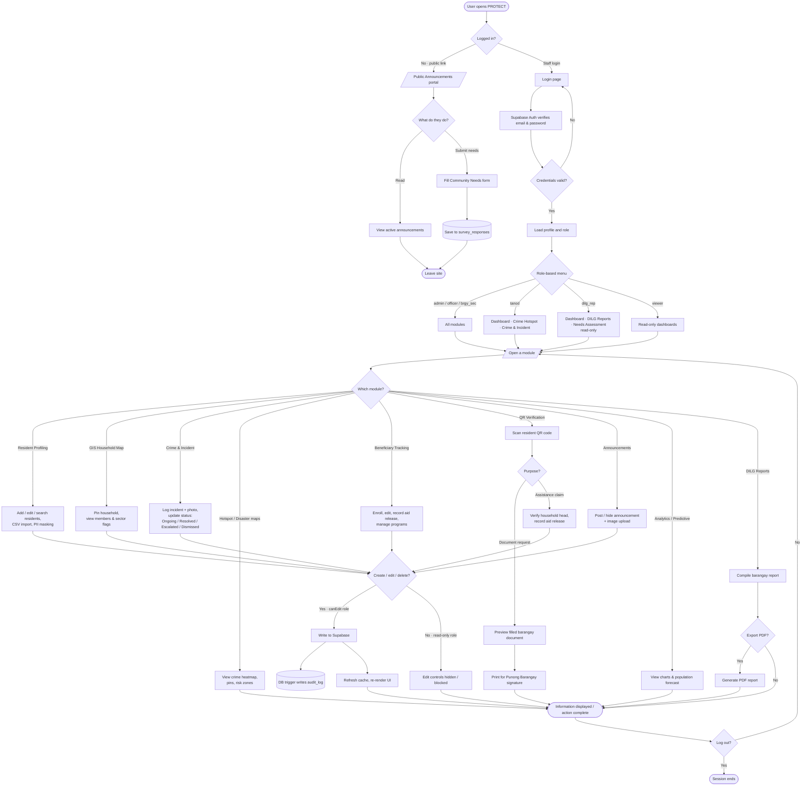
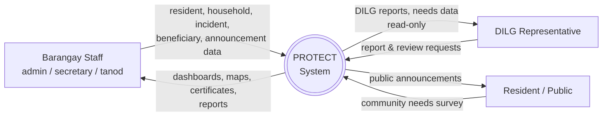
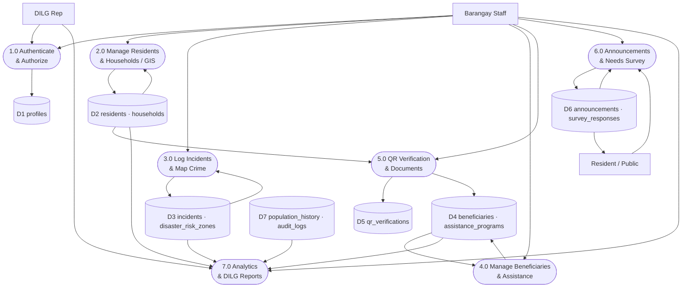

# PROTECT — System Diagrams

**Barangay San Joaquin, Basco, Batanes**

Three diagrams for the capstone documentation, derived from the actual system:

1. **ERD** — see [`DATA_MODEL.md`](DATA_MODEL.md) §4 (entities, fields, relationships)
2. **System Flowchart** — below
3. **Data Flow Diagram (DFD)** — below (Context / Level 0 + Level 1)

> All diagrams use **Mermaid**. They render automatically on GitHub. To export an
> image for your paper, paste a block into <https://mermaid.live> and download as PNG/SVG.
>
> **Pre-rendered PNG images** are in the [`diagrams/`](diagrams/) folder:
> [`flowchart.png`](diagrams/flowchart.png) ·
> [`dfd_context.png`](diagrams/dfd_context.png) ·
> [`dfd_level1.png`](diagrams/dfd_level1.png) ·
> [`erd.png`](diagrams/erd.png) — drag these straight into your document.

---

## 1. System Flowchart

How a user moves through the system: login → role check → permitted modules → actions
(with the read-only / edit permission branch).

---

## 2. Data Flow Diagram — Context Diagram (Level 0)

The whole system as one process, showing the external entities and what flows in/out.

---

## 3. Data Flow Diagram — Level 1

The major processes, the data stores they use, and the flows between them.
(Data stores map to the database tables in `DATA_MODEL.md`.)

### Process ↔ data store key

| Process | Reads / writes | App screens |
|---------|----------------|-------------|
| 1.0 Authenticate & Authorize | D1 profiles | Login, User Management |
| 2.0 Manage Residents & Households | D2 residents, households | Resident Profiling, GIS Household Map |
| 3.0 Log Incidents & Map Crime | D3 incidents, disaster_risk_zones | Crime & Incident, Crime Hotspot Map, Disaster Vulnerability |
| 4.0 Manage Beneficiaries & Assistance | D4 beneficiaries, assistance_programs | Beneficiary Tracking |
| 5.0 QR Verification & Documents | D2 (read), D5 qr_verifications, D4 (release) | QR Verification |
| 6.0 Announcements & Needs Survey | D6 announcements, survey_responses | Announcements (admin), Public Announcements, Needs Assessment |
| 7.0 Analytics & DILG Reports | D2, D3, D4, D7 (read) | Dashboard, Poverty/Sector/Population Analytics, Predictive Growth, DILG Reports |

---

## Notes for your documentation

- **Symbols:** in the DFD, rounded boxes = **processes**, plain boxes = **external entities**,
  cylinders `[( )]` = **data stores**. If your school requires Gane-Sarson notation
  (numbered rectangles + open-ended store bars), redraw these in your diagram tool using
  this structure — the *flows and labels* are what matter and they're all here.
- **Data stores = tables:** each `Dn` groups related tables from `DATA_MODEL.md`, so your
  DFD and ERD stay consistent.
- **Audit logging is automatic:** writes from processes 2.0 and 3.0 also drop a record in
  `audit_logs` via a database trigger — shown flowing into D7.
